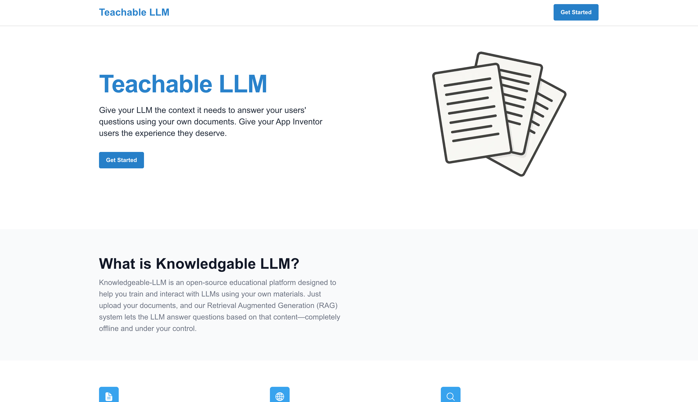

# Teachable LLM Web Playground  

An open-source web app for experimenting with **Retrieval-Augmented Generation (RAG)** pipelines fully in-browser. Built as part of **Google Summer of Code 2025** project with [MIT App Inventor](https://appinventor.mit.edu).  

The playground allows you to upload documents, generate embeddings, test retrieval, and chat with a local LLM — all offline in your browser — before exporting a compact database for use in MIT App Inventor apps.  

  

---

## Features  

- **Document management**  
  - Upload plain-text or PDF files  
  - Search, edit, and delete documents  
  - Import/export a complete RAG database  

- **RAG database**  
  - Stored as JSON with three keys:  
    - `index` → HNSW index (via [MeMemo](https://github.com/poloclub/mememo))  
    - `keys` → metadata for documents  
    - `embeddings` → vector embeddings of documents  
  - Export/import to avoid recalculating embeddings  

- **Chat with context**  
  - Powered by [WebLLM](https://github.com/mlc-ai/web-llm) running **Llama 3.2 1B Instruct** locally with WebGPU  
  - On-device inference, no API keys or cloud costs  
  - Fetches top-5 relevant documents for each prompt  
  - Linked citations for transparency  

- **Embeddings**  
  - Uses [Transformers.js](https://github.com/huggingface/transformers.js) with **Nomic Embed Text v1**  
  - Runs in a Web Worker for speed and responsiveness  

- **PDF handling**  
  - Simple Next.js API route splits PDFs into per-page documents before embedding  

---

## Getting Started  

### Prerequisites  
- Node.js (>= 18)  
- Yarn, npm, or pnpm  

### Install dependencies  
```bash
yarn install
# or
npm install
```

### Run development server
```
yarn dev
# or
npm run dev
```

## License
This project is licensed under the MIT License. See the [LICENSE](https://github.com/Tonyhrule/Teachable-LLM/blob/main/LICENSE) file for details.
